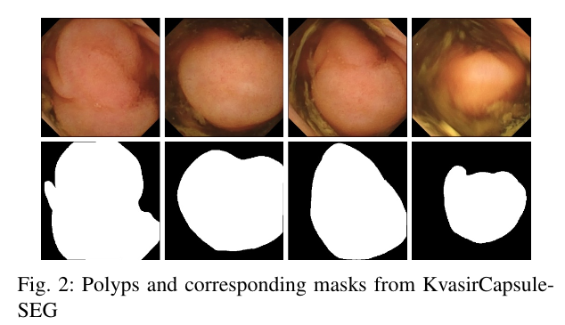

# Kvasircapsule-SEG

The repository contains the Kvasircapsule-seg dataset. It includes 55 medically verified video capsule frames polyp frames.  We have annotated the polyp class of  KvasirCapsule and generated corresponding ground truth masks. Examples of polyps and their corresponding masks from KvasirCapsule-SEG. The Kvasir-Capsule can be downloaded this github repository and the dropbox link: [https://www.dropbox.com/home/KvasirCapsule-SEG](https://www.dropbox.com/home/KvasirCapsule-SEG). 

The official website for the dataset is:
https://datasets.simula.no/kvasir-capsule-seg/

## Pillcam 

## Dataset sample

## Results

## Citation
Please cite our paper if you find the work useful: 
<pre>
@proceedings{jha2021nanonet,
  title={NanoNet: Real-Time Polyp Segmentation in Endoscopy},
  author={Jha, Debesh and Tomar, Nikhil Kumar and Ali, Sharib and Riegler, Michael A and Johansen, H{\aa}vard D and Johansen, Dag and Halvorsen, P{\aa}l},
  booktitle={IEEE Computer Based Multimedia System},
  publisher={IEEE}
}
</pre>

## uses 
It is an open-access dataset which can be downloaded for research and academic purpose. For industrial purpose, a prior consent is required before using them. 

## Contact
Please contact debesh.jha@northwestern.edu for any further questions.
