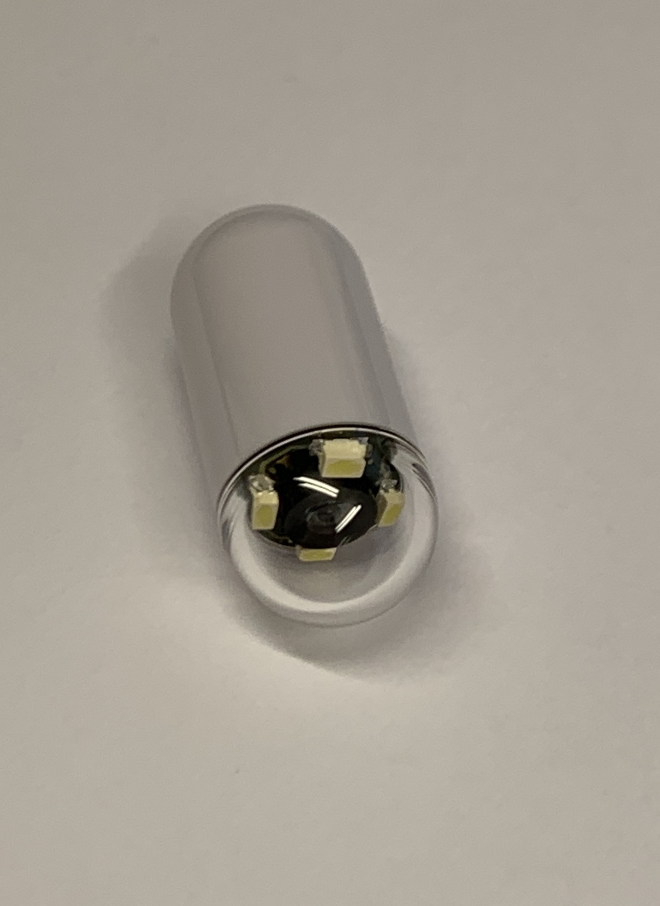
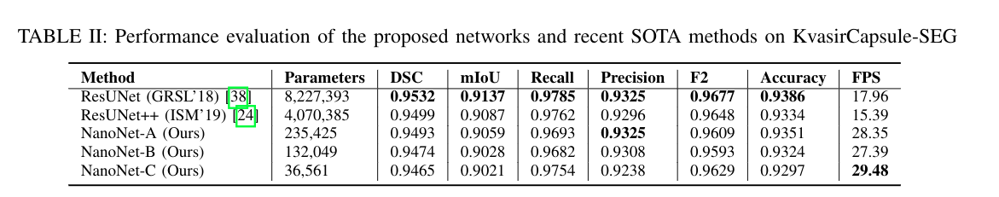

## Kvasircapsule-SEG (Open-access capsule endoscopy polyp segmentation dataset)

The repository contains the Kvasircapsule-seg dataset. It includes 55 medically verified video capsule polyp frames from the Kvasir-Capsule dataset. We have annotated the polyp class of KvasirCapsule and generated corresponding ground truth masks. **__This dataset can be used for semantic meta-learning, domain generalization, semantic segmentation, and out-of-distribution detection task__**.

## Pillcam 
__A capsule endoscopy procedure enables direct visualization of the small bowel.__

__It is used for capturing video capsule frames.__ The examples of capsule endoscopy polyp frames are below:
## KvasirCapsule-SEG dataset

## Baseline Results on KvasirCapsule-SEG

### Dataset Downloads
The dataset can be downloaded using the following link: https://datasets.simula.no/kvasir-capsule-seg/
Alternatively, the Kvasir-Capsule can be downloaded from this GitHub repository and the Dropbox link: [https://www.dropbox.com/home/KvasirCapsule-SEG](https://www.dropbox.com/home/KvasirCapsule-SEG). 

### Paper publication link
The official publication link of the [NanoNet](https://ieeexplore.ieee.org/document/9474743) work.  
Here is the arxiv link of the [NanoNet](https://arxiv.org/pdf/2104.11138.pdf) architecture. 

## Citation
Please cite our paper if you find the work useful: 
<pre>
@proceedings{jha2021nanonet,
  title={NanoNet: Real-Time Polyp Segmentation in Endoscopy},
  author={Jha, Debesh and Tomar, Nikhil Kumar and Ali, Sharib and Riegler, Michael A and Johansen, H{\aa}vard D and Johansen, Dag and Halvorsen, P{\aa}l},
  booktitle={Proceedings of the IEEE Computer Based Multimedia System},
  year={2021},
  publisher={IEEE}
}
</pre>

## uses 
It is an open-access dataset that can be downloaded for research and academic purposes. For industrial purposes, prior consent is required before using them. 

## Contact
Please reach out to debeshjha1@gmail.com for any further questions.
